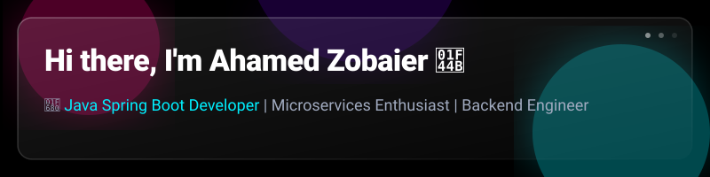
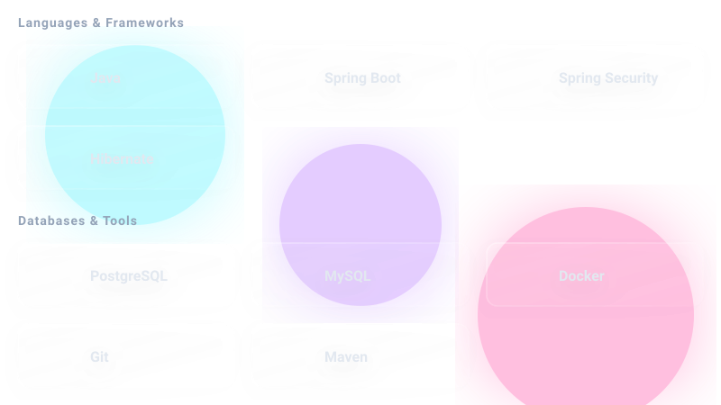

  

## 🚀 About Me
I am a passionate **Java Spring Boot Developer** dedicated to building scalable, high-performance backend systems [4, 12]. With a strong foundation in enterprise-level application development, I focus on creating clean, maintainable code and robust microservices architectures [5, 13].

- 🔭 I’m currently working on **[Add your current project from your CV here]**
- 🌱 I’m currently learning **[e.g., Cloud Native Java / Kubernetes / System Design]**
- 💬 Ask me about **Java, Spring Framework, RESTful APIs, and Database Optimization** [14, 15]
- 📫 How to reach me: **[Add your professional email]** | **[LinkedIn Profile Link]** [6, 16, 17]
- ⚡ Fun fact: **[Add a fun fact or hobby to show your personality]** [6, 9, 18]

## 🛠 Tech Stack

  

## 📊 GitHub Stats
<!-- These dynamic cards provide instant credibility through quantified data [21-23] -->

## 🏆 Featured Projects
<!-- Pin these repos manually in your profile settings. Use READMEs for each to explain "The What" and "The Why" [15, 24] -->
- **[Project Name 1]**: A full-stack application built with Spring Boot and React. [Describe its impact, e.g., improved processing time by 20%] [3, 25].
- **[Project Name 2]**: A microservices-based API implementing Spring Cloud and Netflix Eureka for service discovery [5].

---

### 💫 Welcome to My Developer Portfolio

*A passionate Computer Science & Engineering student crafting elegant solutions to complex problems*

---

## 🎯 About Me

**Computer Science & Engineering Undergraduate | Uttara University, Dhaka**

Driven by curiosity and passion for technology, I build scalable web applications and solve algorithmic challenges. Currently seeking internship opportunities to apply my skills in a dynamic tech environment.

---

## 🛠️ Tech Stack & Skills

### 🔤 Programming Languages

### 🌐 Web Development & Frameworks

### 🗄️ Databases & Backend

### 🛠️ Tools & Development Environment

### 🎨 Design & UI/UX

---

## 🚀 Featured Projects

### 📊 Student Result Management System
**Full-Stack Web Application**

Comprehensive system for managing student academic records with automated GPA calculations and result generation.
- ✨ Real-time data processing
- 📈 Advanced analytics dashboard
- 🔐 Secure authentication system

---

### 🌤️ Weather Application
**Responsive Web App with Real-time Data**

Beautiful and responsive weather application fetching real-time data from OpenWeather API with stunning UI.
- 📍 Location-based weather
- 🎨 Modern responsive design
- 📊 Detailed weather forecasts

---

### 📚 Library Management System
**Desktop GUI Application**

Professional desktop application for managing library operations including inventory and member management.
- 🏗️ Object-Oriented Architecture
- 🔍 Advanced search & filtering
- 📋 Complete transaction logging

---

### 🚌 UU Bus Service
**Full-Stack Booking Platform**

Scalable bus booking platform with Spring Boot backend and comprehensive REST APIs.
- 🎫 Online ticket booking system
- 💳 Payment integration ready
- 📱 Mobile-friendly interface

---

## 📈 GitHub Analytics

---

## 🎓 Technical Expertise

| Area | Expertise Level |
|------|-----------------|
| **Data Structures & Algorithms** | ⭐⭐⭐⭐⭐ |
| **Full-Stack Web Development** | ⭐⭐⭐⭐☆ |
| **Java & OOP Programming** | ⭐⭐⭐⭐☆ |
| **Database Design & Management** | ⭐⭐⭐⭐☆ |
| **UI/UX Design** | ⭐⭐⭐⭐☆ |
| **Version Control & Git** | ⭐⭐⭐⭐⭐ |
| **Problem Solving** | ⭐⭐⭐⭐⭐ |

---

## 🎯 Current Focus

🔨 **Building** → Scalable backend systems with Spring Boot  
📚 **Learning** → React.js & Advanced JavaScript Frameworks  
🤝 **Contributing** → Open-source projects & developer community  
💡 **Exploring** → Cloud technologies & DevOps practices  

---

## 🌟 Key Highlights

🎓 **BSc Computer Science & Engineering** | Uttara University, Dhaka  
💻 **Full-Stack Developer** | Building modern web applications  
🏆 **Problem Solver** | Competitive programming enthusiast  
🎨 **Designer** | Expert in Adobe Creative Suite  
🚀 **Tech Enthusiast** | Always learning & growing  

---

## 📬 Get In Touch

I'm always excited to collaborate on interesting projects and connect with fellow developers!

---

### ⭐ If you find my work interesting, feel free to star my repositories!

---

**Made with ❤️ by Zobaier Hasan | Last Updated: 2026**

